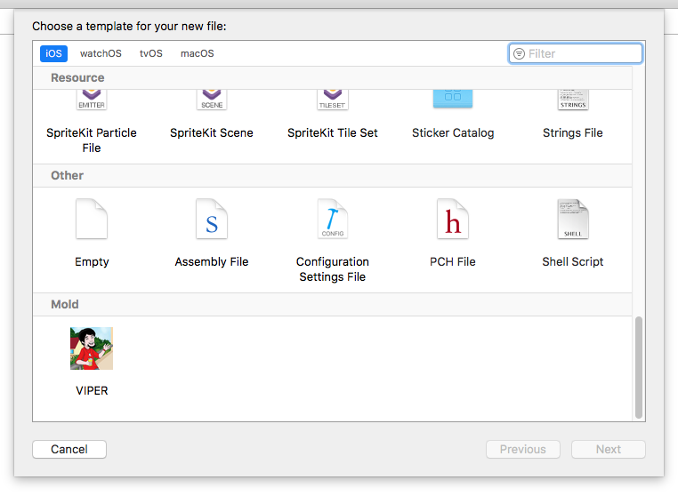
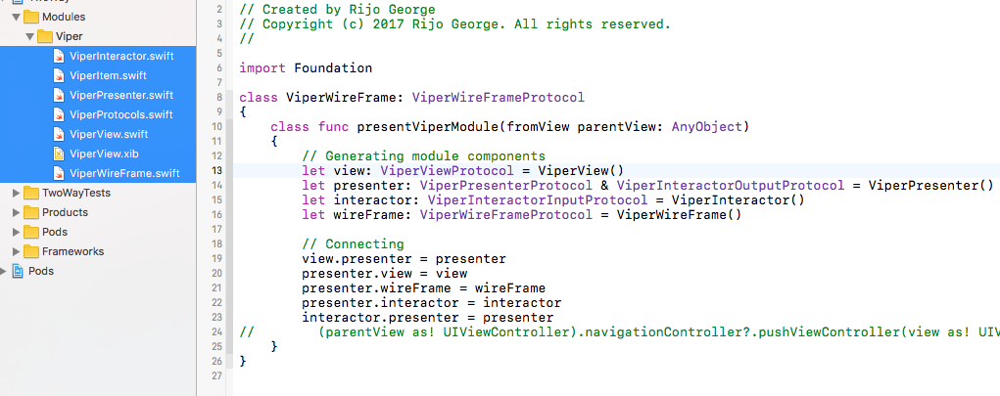

*Mold gives super power to your Xcode with ready-to-use templates. Mold includes template for VIPER now. MVVM, MVP and good ol' MVC will be added soon.*




## About


## Installation
1. Download the files from this repository.
2. Open Termial
3. Navigate to the folder
4. Run the following script
5. That's it :)
```shell
sudo swift mold.swift
```

## Usage

After installing you can access the templates from File -> New File. Scroll to the bottom and you can see a section named Mold.



## License

This project is released under the [MIT license](https://github.com/rgeorgesuyati/Mold/blob/master/LICENSE).

## About

Mold is developed and maintained by Rijo George @rgeorgesuyati. 
