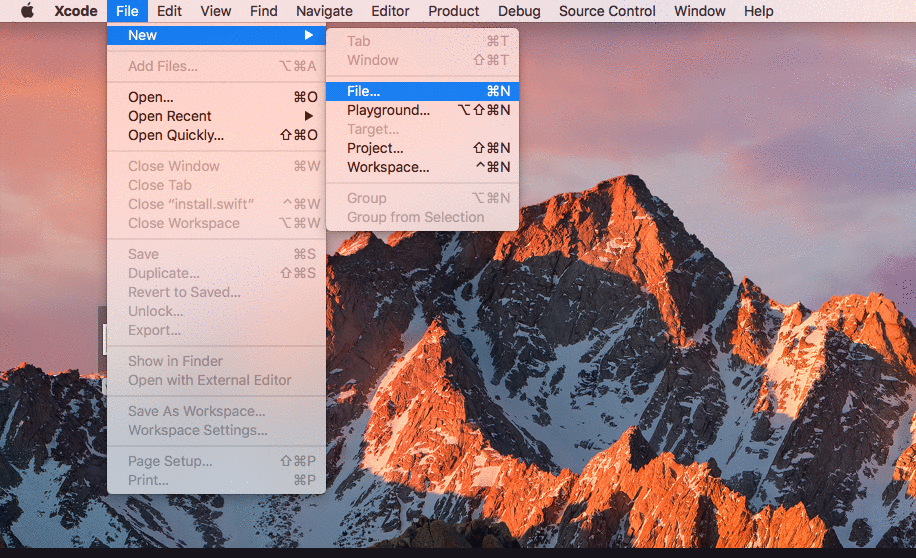

## Mold
*Mold gives super power to your Xcode with ready-to-use templates. Mold includes template for VIPER now. MVVM and MVP will be added soon.*

While using architecture like VIPER or MVP,it is tiresome to create files and establish connections. For example if you are following VIPER architecture, you will have to create atleast 5 files for one module. You also have to create connections between all these components using protocols. 

Mold will help you create these files and establish all the connections in a very few steps. Mold will be available as a template in your Xcode itself. 


## VIPER

VIPER is an application of Clean Architecture to iOS apps. The word VIPER is a backronym for View, Interactor, Presenter, Entity, and Routing. Clean Architecture divides an app’s logical structure into distinct layers of responsibility. This makes it easier to isolate dependencies (e.g. your database) and to test the interactions at the boundaries between layers:
 

more: https://www.objc.io/issues/13-architecture/viper/

## Installation
1. Download the files from this repository.
2. Open Termial
3. Navigate to the downloaded folder
4. Run the following script
5. That's it :)
```shell
sudo swift mold.swift
```

## Usage

After installing you can access the templates from File -> New File. Scroll to the bottom and you can see a section named Mold.



## License

This project is released under the [MIT license](https://github.com/rgeorgesuyati/Mold/blob/master/LICENSE).

## About

Mold is developed and maintained by Rijo George @rgeorgesuyati. 
